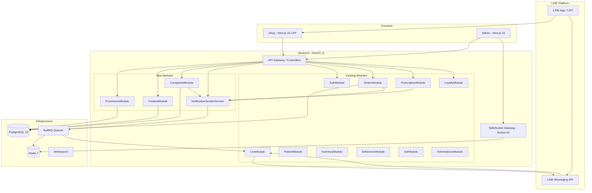
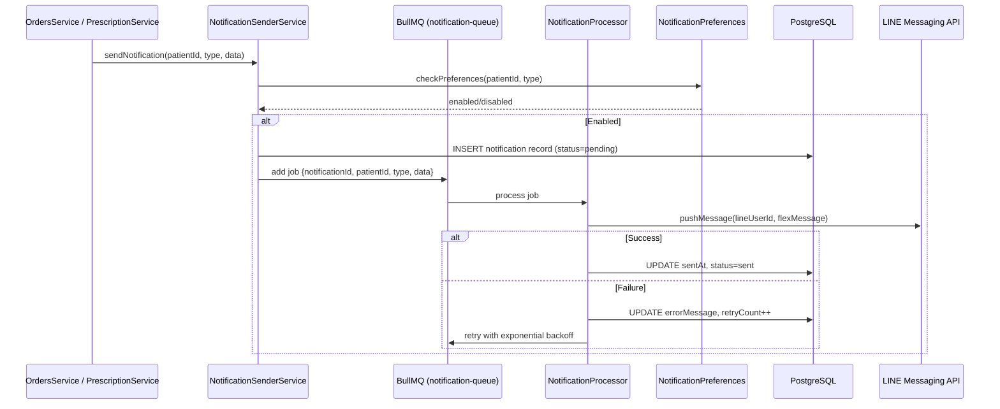
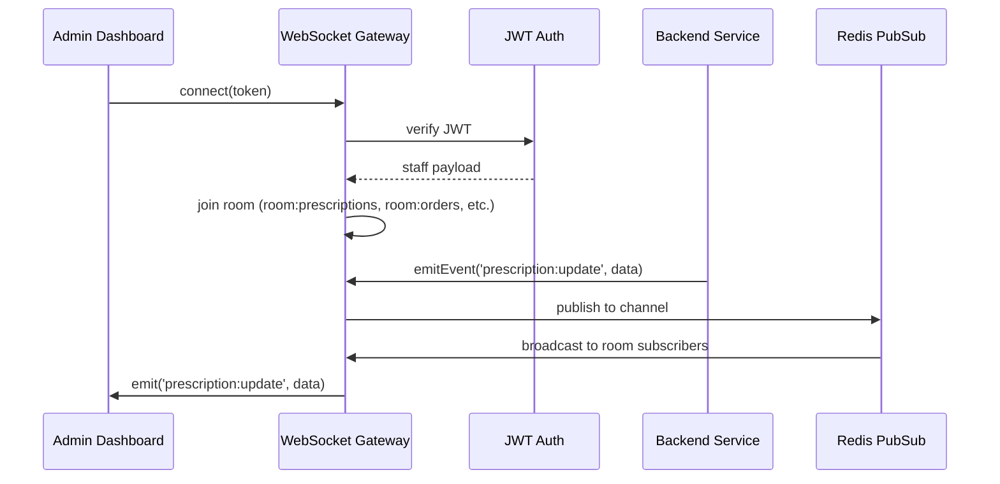
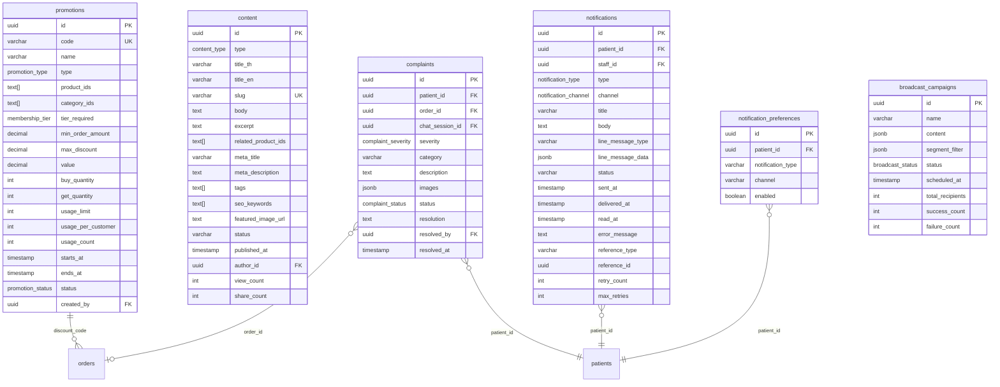

# Design Document — Telepharmacy ERP: Full Implementation ของส่วนที่ขาด

## Overview

เอกสารนี้ออกแบบสถาปัตยกรรมและ implementation plan สำหรับ 8 โมดูลหลักที่ยังขาดในระบบ LINE Telepharmacy ERP:

1. **Promotions Engine** — CRUD + coupon validation + usage tracking
2. **Content/Health Articles CMS** — CRUD + public browsing + view counting + SEO
3. **Complaints System** — Patient submission + Staff resolution + notification trigger
4. **Notification Push Engine** — BullMQ-based async LINE push + retry + preferences
5. **WebSocket Real-time Events Gateway** — Socket.IO gateway สำหรับ admin dashboard
6. **Customer Shop (LIFF) Pages** — Product search, Rx upload, orders, profile, consultation, medication reminders, ADR, AI consult, notifications
7. **Admin Dashboard Pages** — Promotions, content, complaints, reports/analytics, messaging, settings
8. **LINE Module Completion** — Webhook routing + Flex Messages สำหรับทุก event type

### Design Decisions & Rationale

| Decision | Rationale |
|----------|-----------|
| BullMQ สำหรับ notification dispatch | ใช้ pattern เดียวกับ slip OCR queue ที่มีอยู่แล้ว, รองรับ retry + exponential backoff |
| Socket.IO via `@nestjs/websockets` | NestJS มี built-in adapter, ใช้ JWT auth ผ่าน handshake token ได้ทันที |
| Recharts สำหรับ admin charts | Lightweight, React-native, รองรับ responsive + interactive charts |
| Zustand stores สำหรับ shop state | ตาม pattern ที่มีอยู่ (auth, cart, address stores) |
| SWR + `useApi` hook สำหรับ admin | ตาม pattern ที่มีอยู่ใน admin dashboard |
| Existing DB schemas ไม่ต้องเปลี่ยน | ทุก table ที่ต้องการ (promotions, content, complaints, notifications, etc.) ถูก define ไว้แล้วใน `packages/db/src/schema/` |

---

## Architecture

### System Architecture Diagram



### Event Flow — Notification Pipeline



### WebSocket Event Flow



---

## Components and Interfaces

### 1. PromotionsModule (Backend)

```
apps/api/src/modules/promotions/
├── promotions.module.ts
├── promotions.controller.ts      # Staff CRUD: /v1/staff/promotions
├── promotions-public.controller.ts # Patient: /v1/orders/validate-coupon
├── promotions.service.ts          # Business logic + validation
└── dto/
    ├── create-promotion.dto.ts
    ├── update-promotion.dto.ts
    └── validate-coupon.dto.ts
```

**Key Interfaces:**

```typescript
// PromotionsService
interface PromotionsService {
  create(dto: CreatePromotionDto, staffId: string): Promise<Promotion>;
  update(id: string, dto: UpdatePromotionDto): Promise<Promotion>;
  findAll(filters: { status?: string; type?: string; startDate?: Date; endDate?: Date }, page: number, limit: number): Promise<PaginatedResult<Promotion>>;
  findOne(id: string): Promise<Promotion>;
  delete(id: string): Promise<void>;
  activate(id: string): Promise<Promotion>;
  deactivate(id: string): Promise<Promotion>;
  validateCoupon(code: string, patientId: string, orderAmount: number, patientTier: string): Promise<CouponValidationResult>;
  applyCoupon(promotionId: string, orderId: string): Promise<void>;
}

interface CouponValidationResult {
  valid: boolean;
  promotion?: Promotion;
  discountAmount?: number;
  errorMessage?: string; // Thai error message
}
```

### 2. ContentModule (Backend)

```
apps/api/src/modules/content/
├── content.module.ts
├── content.controller.ts          # Public: /v1/content
├── content-staff.controller.ts    # Staff: /v1/staff/content
├── content.service.ts
└── dto/
    ├── create-content.dto.ts
    ├── update-content.dto.ts
    └── query-content.dto.ts
```

**Key Interfaces:**

```typescript
interface ContentService {
  create(dto: CreateContentDto, authorId: string): Promise<Content>;
  update(id: string, dto: UpdateContentDto): Promise<Content>;
  publish(id: string): Promise<Content>;
  unpublish(id: string): Promise<Content>;
  findAll(filters: QueryContentDto): Promise<PaginatedResult<Content>>;
  findBySlug(slug: string): Promise<Content>;
  incrementViewCount(id: string): Promise<void>;
  delete(id: string): Promise<void>;
}
```

### 3. ComplaintsModule (Backend)

```
apps/api/src/modules/complaints/
├── complaints.module.ts
├── complaints.controller.ts       # Patient: /v1/complaints
├── complaints-staff.controller.ts # Staff: /v1/staff/complaints
├── complaints.service.ts
└── dto/
    ├── create-complaint.dto.ts
    ├── resolve-complaint.dto.ts
    └── query-complaints.dto.ts
```

**Key Interfaces:**

```typescript
interface ComplaintsService {
  create(patientId: string, dto: CreateComplaintDto): Promise<Complaint>;
  findMyComplaints(patientId: string, page: number, limit: number): Promise<PaginatedResult<Complaint>>;
  findAll(filters: QueryComplaintsDto): Promise<PaginatedResult<Complaint>>;
  findOne(id: string): Promise<Complaint>;
  resolve(id: string, dto: ResolveComplaintDto, staffId: string): Promise<Complaint>;
  updateStatus(id: string, status: string): Promise<Complaint>;
}
```

### 4. NotificationSenderService (Enhancement to existing NotificationsModule)

```
apps/api/src/modules/notifications/
├── notifications.module.ts        # เพิ่ม BullMQ import
├── notifications.controller.ts    # เดิม (patient read/mark)
├── notifications.service.ts       # เดิม (query/mark read)
├── notification-sender.service.ts # ใหม่: create + dispatch
├── notification.processor.ts      # ใหม่: BullMQ processor
└── dto/
    └── send-notification.dto.ts
```

**Key Interfaces:**

```typescript
interface NotificationSenderService {
  send(params: {
    patientId: string;
    type: NotificationType;
    channel?: NotificationChannel;
    title: string;
    body: string;
    referenceType?: string;
    referenceId?: string;
    lineMessageData?: object;
  }): Promise<Notification>;
}

// NotificationProcessor handles BullMQ jobs
interface NotificationProcessor {
  process(job: Job<NotificationJobData>): Promise<void>;
}
```

### 5. EventsGateway (WebSocket)

```
apps/api/src/modules/events/
├── events.module.ts
├── events.gateway.ts              # @WebSocketGateway('/ws')
├── events.service.ts              # emit helpers
└── guards/
    └── ws-jwt.guard.ts
```

**Key Interfaces:**

```typescript
interface EventsGateway {
  // Socket.IO events
  handleConnection(client: Socket): void;
  handleDisconnect(client: Socket): void;
  handleSubscribe(client: Socket, rooms: string[]): void;
}

interface EventsService {
  emitPrescriptionUpdate(data: PrescriptionSummary): void;
  emitOrderUpdate(data: OrderSummary): void;
  emitChatMessage(data: ChatMessageSummary): void;
  emitNewComplaint(data: ComplaintSummary): void;
}
```

### 6. Shop LIFF Pages (Frontend)

หน้าที่ต้อง implement ใหม่หรือ enhance จาก stub:

| Route | Component | Status |
|-------|-----------|--------|
| `/articles` | ArticlesListPage | ใหม่ |
| `/articles/[slug]` | ArticleDetailPage | ใหม่ |
| `/complaints/new` | NewComplaintPage | ใหม่ |
| `/complaints` | ComplaintsHistoryPage | ใหม่ |
| `/search` | SearchPage | มีแล้ว — enhance filters |
| `/product/[id]` | ProductDetailPage | มีแล้ว — enhance |
| `/rx/upload` | RxUploadPage | มีแล้ว — enhance |
| `/rx` | RxListPage | มีแล้ว — enhance |
| `/rx/[id]` | RxDetailPage | มีแล้ว — enhance |
| `/orders` | OrdersPage | มีแล้ว — enhance |
| `/orders/[id]` | OrderDetailPage | มีแล้ว — enhance |
| `/profile` | ProfilePage | มีแล้ว — enhance |
| `/profile/edit` | EditProfilePage | มีแล้ว |
| `/profile/allergies` | AllergiesPage | มีแล้ว |
| `/profile/diseases` | DiseasesPage | มีแล้ว |
| `/profile/loyalty` | LoyaltyPage | มีแล้ว |
| `/profile/kyc` | KycPage | มีแล้ว |
| `/consultation` | ConsultationPage | มีแล้ว — enhance |
| `/consultation/[id]` | ChatPage | มีแล้ว — enhance |
| `/consultation/[id]/video` | VideoCallPage | มีแล้ว |
| `/consultation/[id]/consent` | ConsentPage | มีแล้ว |
| `/consultation/history` | ConsultationHistoryPage | มีแล้ว |
| `/medication-reminders` | RemindersPage | มีแล้ว — enhance |
| `/adr-report` | AdrReportPage | มีแล้ว — enhance |
| `/ai-consult` | AiConsultPage | มีแล้ว — enhance |
| `/notifications` | NotificationsPage | มีแล้ว — enhance |

### 7. Admin Dashboard Pages (Frontend)

| Route | Component | Status |
|-------|-----------|--------|
| `/dashboard/promotions` | PromotionsPage | ใหม่ |
| `/dashboard/promotions/new` | NewPromotionPage | ใหม่ |
| `/dashboard/promotions/[id]` | EditPromotionPage | ใหม่ |
| `/dashboard/content` | ContentListPage | ใหม่ |
| `/dashboard/content/new` | ContentEditorPage | ใหม่ |
| `/dashboard/content/[id]` | ContentEditorPage | ใหม่ |
| `/dashboard/complaints` | ComplaintsPage | ใหม่ |
| `/dashboard/complaints/[id]` | ComplaintDetailPage | ใหม่ |
| `/dashboard/reports` | ReportsPage | มีแล้ว — enhance with charts |
| `/dashboard/messaging` | MessagingPage | มีแล้ว — enhance |
| `/dashboard/settings` | SettingsPage | มีแล้ว — enhance |

### 8. LINE Module Enhancements

เพิ่มเติมใน `LineWebhookService`:
- Text message → AI chatbot → fallback to staff inbox
- Image message → OCR check → auto-create prescription or route to inbox
- Follow event → welcome Flex Message + registration prompt

เพิ่มเติมใน `FlexMessageService`:
- Order confirmation template
- Payment QR template
- Prescription status template
- Delivery tracking template
- Medication reminder template
- Promotional message template
- Welcome message template

---

## Data Models

ทุก table ที่ต้องการถูก define ไว้แล้วใน `packages/db/src/schema/` ไม่ต้องสร้างใหม่:

### Existing Tables Used



### Key Relationships

- `promotions.code` → `orders.discount_code` (coupon applied to order)
- `complaints.patient_id` → `patients.id`
- `complaints.order_id` → `orders.id` (optional)
- `complaints.resolved_by` → `staff.id`
- `notifications.patient_id` → `patients.id`
- `notification_preferences.patient_id` → `patients.id`
- `content.author_id` → `staff.id`


---

## Correctness Properties

*A property is a characteristic or behavior that should hold true across all valid executions of a system — essentially, a formal statement about what the system should do. Properties serve as the bridge between human-readable specifications and machine-verifiable correctness guarantees.*

### Property 1: Promotion CRUD round-trip

*For any* valid promotion DTO, creating a promotion and then reading it back by ID should return an equivalent promotion with all fields preserved (code, name, type, value, limits, dates, targeting).

**Validates: Requirements 1.1**

### Property 2: Promotion type-specific validation

*For any* promotion creation DTO, if the type is `percentage_discount` then `value` must be between 1–100 and `maxDiscount` must be provided; if the type is `buy_x_get_y` then `buyQuantity` and `getQuantity` must be provided. Invalid DTOs should be rejected, valid DTOs should be accepted.

**Validates: Requirements 1.2, 1.3**

### Property 3: Coupon validation correctness

*For any* promotion and any order context (amount, patient tier, current date), the coupon validation should return `valid=true` if and only if: the code exists, status is `active`, `usageCount < usageLimit`, order amount ≥ `minOrderAmount`, patient tier meets `tierRequired`, and current date is within `startsAt`–`endsAt` range.

**Validates: Requirements 1.4**

### Property 4: Coupon usage count invariant

*For any* valid coupon application to an order, the promotion's `usageCount` should increment by exactly 1, and the order's `discountAmount` should equal the computed discount.

**Validates: Requirements 1.6**

### Property 5: Promotion list filtering

*For any* set of promotions and any combination of filters (status, type, date range), all returned promotions should match every active filter criterion, and no matching promotion should be excluded.

**Validates: Requirements 1.7**

### Property 6: Content CRUD round-trip

*For any* valid content DTO (with title, slug, body, type, SEO fields, tags, relatedProductIds), creating content and then reading it back by ID should return equivalent content with all fields preserved.

**Validates: Requirements 3.1, 3.6, 3.7**

### Property 7: Content publish state transition

*For any* content item in `draft` status, publishing it should set `status` to `published` and `publishedAt` to a non-null timestamp. Unpublishing should set `status` back to `draft`.

**Validates: Requirements 3.3**

### Property 8: Public content filtering — published only

*For any* query to the public content endpoint, all returned items should have `status=published` and a non-null `publishedAt`. No draft or unpublished content should appear in results. Additionally, all returned items should match the requested type and tag filters.

**Validates: Requirements 3.4**

### Property 9: Content view count increment

*For any* content item, calling the view endpoint should increment `viewCount` by exactly 1.

**Validates: Requirements 3.5**

### Property 10: Complaint CRUD round-trip

*For any* valid complaint DTO (category, description, severity, images, optional orderId), creating a complaint and reading it back should return equivalent data with `status=open`.

**Validates: Requirements 5.1**

### Property 11: Patient complaint isolation

*For any* patient, querying their complaints should return only complaints where `patientId` matches that patient. No other patient's complaints should be visible.

**Validates: Requirements 5.2**

### Property 12: Complaint resolution state transition

*For any* open or in-progress complaint, resolving it should set `resolution` to the provided text, `resolvedBy` to the staff ID, `resolvedAt` to a non-null timestamp, and `status` to `resolved`.

**Validates: Requirements 5.4**

### Property 13: Complaint status change triggers notification

*For any* complaint whose status changes, a notification record should be created for the complaint's patient with `referenceType='complaint'` and `referenceId` matching the complaint ID.

**Validates: Requirements 5.5**

### Property 14: Notification send creates DB record and enqueues job

*For any* call to `NotificationSenderService.send()` with a valid patient and enabled notification type, a notification record should be created in the database with `status=pending`, and a BullMQ job should be enqueued.

**Validates: Requirements 7.1**

### Property 15: Status change triggers notification

*For any* order status change to `paid`, `shipped`, or `delivered`, and for any prescription status change to `approved`, `rejected`, or `dispensed`, a notification should be created for the associated patient.

**Validates: Requirements 7.3, 7.4**

### Property 16: Notification retry respects maxRetries

*For any* failed notification, the retry count should increment by 1 on each failure. When `retryCount` reaches `maxRetries`, no further retries should be attempted and the notification status should be set to `failed`.

**Validates: Requirements 7.5**

### Property 17: Notification delivery status update

*For any* notification that is processed, if delivery succeeds then `sentAt` should be set to a non-null timestamp and `status` should be `sent`. If delivery fails, `errorMessage` should be non-empty and `retryCount` should increment.

**Validates: Requirements 7.6**

### Property 18: Notification preferences respected

*For any* patient with a disabled notification preference for a given type and channel, calling `NotificationSenderService.send()` for that type should not create a notification record (or should mark it as skipped).

**Validates: Requirements 7.7**

### Property 19: WebSocket room-based event delivery

*For any* entity change event (prescription update, order update, chat message, new complaint), the WebSocket gateway should emit the event only to clients subscribed to the corresponding room (`room:prescriptions`, `room:orders`, `room:chat`, `room:complaints`). Clients not in the room should not receive the event.

**Validates: Requirements 8.2, 8.3, 8.4, 8.5, 8.6**

### Property 20: Product search filter correctness

*For any* set of products and any combination of filters (category, drug classification, price range, in-stock), all returned products should match every active filter, and no matching product should be excluded.

**Validates: Requirements 9.3**

### Property 21: Product card displays all required fields

*For any* product, the rendered product card should contain: product name (Thai), brand, price, unit, stock status indicator, and a "requires prescription" indicator if the drug classification is `dangerous_drug`, `specially_controlled`, `psychotropic`, or `narcotic`.

**Validates: Requirements 9.4**

### Property 22: Order tracking timeline correctness

*For any* order with a given status, the tracking timeline should show the correct progression steps as completed/active/pending based on the order status sequence: confirmed → preparing → shipped → delivered.

**Validates: Requirements 11.3**

### Property 23: Reorder adds same items to cart

*For any* completed order with N items, triggering reorder should add exactly N items to the cart with the same product IDs and quantities as the original order.

**Validates: Requirements 11.5**

### Property 24: Consultation requires consent

*For any* telemedicine consultation, the system should not allow the consultation to proceed (chat or video) unless informed consent has been recorded for that consultation session.

**Validates: Requirements 13.4**

### Property 25: Notification tap routes to correct page

*For any* notification with a `referenceType` (order, prescription, consultation, complaint), tapping the notification should navigate to the correct detail page based on the reference type and ID.

**Validates: Requirements 15.5**

### Property 26: Report demographic invariant

*For any* set of patients, the sum of all age group counts should equal the total patient count, and the sum of all gender counts should equal the total patient count.

**Validates: Requirements 17.3**

### Property 27: Promotion report metrics correctness

*For any* set of promotions and their usage data, the computed metrics (total usage, remaining uses, usage rate) should be mathematically consistent: `remainingUses = usageLimit - usageCount` and `usageRate = usageCount / usageLimit`.

**Validates: Requirements 17.2**

### Property 28: CSV export round-trip

*For any* report data set, exporting to CSV and parsing the CSV back should preserve all data values (column names, row values, numeric precision).

**Validates: Requirements 17.5**

### Property 29: LINE text message routing

*For any* incoming LINE text message, the system should first attempt AI chatbot response. If the AI response indicates it cannot handle the query (confidence below threshold or explicit fallback), the message should be routed to the staff inbox.

**Validates: Requirements 18.1**

### Property 30: LINE image message routing

*For any* incoming LINE image message, the system should attempt prescription OCR. If the OCR detects a prescription, a prescription record should be created. Otherwise, the image should be routed to the staff inbox.

**Validates: Requirements 18.2**

### Property 31: Flex Message template completeness

*For any* event type (order confirmation, payment QR, prescription status, delivery tracking, medication reminder, promotion), the generated Flex Message should be a valid LINE Flex Message JSON structure containing the relevant data fields for that event type.

**Validates: Requirements 18.3**

---

## Error Handling

### Backend Error Handling Strategy

| Scenario | HTTP Status | Error Response |
|----------|-------------|----------------|
| Coupon code ไม่พบ | 404 | `{ message: "ไม่พบรหัสคูปอง", code: "COUPON_NOT_FOUND" }` |
| Coupon หมดอายุ | 400 | `{ message: "คูปองหมดอายุแล้ว", code: "COUPON_EXPIRED" }` |
| Coupon ใช้ครบจำนวนแล้ว | 400 | `{ message: "คูปองถูกใช้ครบจำนวนแล้ว", code: "COUPON_USAGE_EXCEEDED" }` |
| ยอดสั่งซื้อไม่ถึงขั้นต่ำ | 400 | `{ message: "ยอดสั่งซื้อขั้นต่ำ {amount} บาท", code: "MIN_ORDER_NOT_MET" }` |
| Tier ไม่ตรง | 400 | `{ message: "คูปองนี้สำหรับสมาชิกระดับ {tier} ขึ้นไป", code: "TIER_NOT_MET" }` |
| Content slug ซ้ำ | 409 | `{ message: "Slug นี้ถูกใช้แล้ว", code: "SLUG_DUPLICATE" }` |
| Complaint ไม่พบ | 404 | `{ message: "ไม่พบข้อร้องเรียน", code: "COMPLAINT_NOT_FOUND" }` |
| Notification send failure | — | Retry via BullMQ, log error, update `errorMessage` field |
| WebSocket auth failure | — | Disconnect client with `{ message: "Unauthorized" }` |
| LINE push failure | — | Retry up to 3 times, then mark notification as `failed` |
| Image upload > 5 files | 400 | `{ message: "อัปโหลดได้สูงสุด 5 รูป", code: "MAX_IMAGES_EXCEEDED" }` |

### Retry Strategy (Notifications)

```typescript
// BullMQ job options for notification queue
{
  attempts: 3,
  backoff: {
    type: 'exponential',
    delay: 5000, // 5s, 25s, 125s
  },
  removeOnComplete: true,
  removeOnFail: false, // keep failed jobs for debugging
}
```

### Frontend Error Handling

- API errors → Toast notification ด้วย Thai error message จาก backend
- Network errors → "ไม่สามารถเชื่อมต่อเซิร์ฟเวอร์ได้ กรุณาลองใหม่"
- WebSocket disconnect → Auto-reconnect with exponential backoff (Socket.IO built-in)
- LIFF initialization failure → Redirect to LINE app with error message

---

## Testing Strategy

### Testing Framework & Libraries

| Layer | Framework | Library |
|-------|-----------|---------|
| Backend unit tests | Jest + ts-jest | `@nestjs/testing` |
| Backend property tests | Jest | `fast-check` |
| Frontend unit tests | Jest | `@testing-library/react` |
| Frontend property tests | Jest | `fast-check` |
| E2E tests | Jest | `supertest` (API), Playwright (UI) |

### Property-Based Testing Configuration

- Library: **fast-check** (TypeScript-native, works with Jest)
- Minimum iterations: **100** per property test
- Each property test MUST be tagged with a comment referencing the design property:
  ```typescript
  // Feature: telepharmacy-full-implementation, Property 3: Coupon validation correctness
  ```
- Each correctness property MUST be implemented by a SINGLE property-based test

### Unit Test Strategy

Unit tests focus on:
- Specific examples that demonstrate correct behavior (e.g., specific coupon codes, specific order amounts)
- Edge cases (e.g., coupon at exact expiry time, zero-amount orders, empty search queries)
- Error conditions (e.g., invalid DTOs, missing required fields, unauthorized access)
- Integration points between modules (e.g., complaint creation triggers notification)

### Property Test Strategy

Property tests focus on:
- Universal validation rules (Properties 2, 3, 5, 8, 20)
- Round-trip / state preservation (Properties 1, 6, 10, 28)
- State transition correctness (Properties 4, 7, 9, 12, 17)
- Data isolation and filtering (Properties 5, 8, 11, 19, 20)
- Invariants (Properties 16, 22, 26, 27)

### Test Organization

```
apps/api/src/modules/promotions/
├── promotions.service.spec.ts          # Unit tests
├── promotions.service.property.spec.ts # Property tests (Properties 1-5)
├── promotions.controller.spec.ts       # Controller unit tests

apps/api/src/modules/content/
├── content.service.spec.ts             # Unit tests
├── content.service.property.spec.ts    # Property tests (Properties 6-9)

apps/api/src/modules/complaints/
├── complaints.service.spec.ts          # Unit tests
├── complaints.service.property.spec.ts # Property tests (Properties 10-13)

apps/api/src/modules/notifications/
├── notification-sender.service.spec.ts          # Unit tests
├── notification-sender.service.property.spec.ts # Property tests (Properties 14-18)

apps/api/src/modules/events/
├── events.gateway.spec.ts              # Unit tests
├── events.gateway.property.spec.ts     # Property tests (Property 19)
```

### Key Test Scenarios (Unit Tests)

**Promotions:**
- Create percentage_discount with value=50, maxDiscount=100 → success
- Create percentage_discount with value=150 → validation error
- Validate coupon with expired date → Thai error message
- Apply coupon → usageCount increments

**Content:**
- Create article with duplicate slug → 409 error
- Publish draft article → publishedAt set
- Public query returns only published items

**Complaints:**
- Create complaint with images → images stored as JSONB
- Resolve complaint → all resolution fields set
- Patient can only see own complaints

**Notifications:**
- Send notification with disabled preference → skipped
- Failed notification retries up to 3 times
- Successful notification sets sentAt

**WebSocket:**
- Unauthenticated connection → rejected
- Subscribe to room:orders → receives order:update events
- Not subscribed to room:orders → does not receive order:update events
